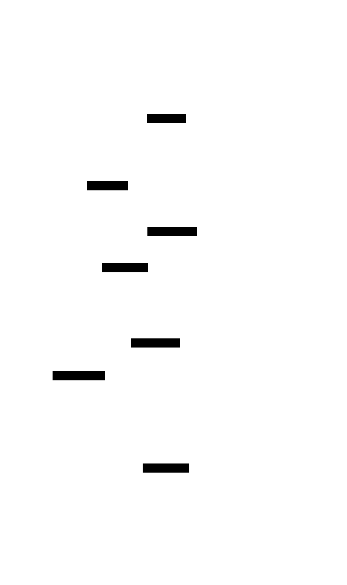

# CI/CD 

The following is an overview of the various aspects of the CI/CD architecture for [Ghaf](https://github.com/tiiuae/ghaf).

Its goal is to be as agnostic as possible with respect to source forges, cloud providers and more. 

Where specific choices have been made (e.g. [Jenkins](https://www.jenkins.io/)) it is worth remembering that most of the
heavy lifting is being done within [Nix](https://nixos.org), and special care will be taken to avoid relying too heavily
on vendor-specific functionality. 

## Overview

The [Ghaf](https://github.com/tiiuae/ghaf) project currently consists of _~52_ build targets per architecture
(e.g. `x86_64-linux`, `aarch64-linux` and so on).

Within those build targets, the major causes of mass rebuilds is a patch to systemd, a low-level component in the build 
tree. This causes all downstream packages to differ from the ones already in cache.nixos.org.

However, these rebuilds only need to happen whenever that part of the build graph changes, which is either during bumps 
of `nixpkgs` itself that touch it, or work on that patch itself.

Most of the time, during day to day operations, the amount of actual rebuilds should be fairly small.

Upstreaming this change to nixpkgs (as has been attempted in https://github.com/NixOS/nixpkgs/pull/239201, but which 
needs to be brought to the finish line) will remove the need for rebuilding this package so deep in the tree and all of 
it dependencies (looking at you Firefox).

> - Hydra is meant to orchestrate a massive amount of attributes (217,000 for nixpkgs vs 52x2 for ghaf) with complex build 
trees that require partitioning and distribution across multiple builders for the same architecture.
> - Even with the current whenever-nixpkgs-is-bumped rebuilds, the build workloads can be done by a single worker in a reasonable amount of time.
> - Therefore, there is no need for all the additional complexity that hydra brings.
> - Hydra is _not actively maintained_. For some context [here is a discussion](https://discourse.nixos.org/t/nixcon-governance-workshop/32705/11) 
that was had at NixCon 2023 which touches on the state of Hydra.
> - We'd be better off invoking [nix-fast-build](https://github.com/Mic92/nix-fast-build) with `-f #.packages.x86_64-linux` 
and `-f #.packages.aarch64-linux` on two separate build machines. 

## Removing Hydra

At a high level, a release consists of the following build steps:

1. A new tag / release is created within source control. This is detected and a build pipeline is triggered.
2. The first of those build steps is a Nix build, ensuring all packages and NixOS configurations complete successfully, 
and for all required architectures.
3. After completing the Nix build, various vulnerability scans can be applied (outside the Nix build) using [sbomnix](https://github.com/tiiuae/sbomnix).
4. Finally, and perhaps also _concurrently_ with step 3, testing on specific types of hardware can be carried out.

> To begin with this pipeline can be triggered upon release, but there's nothing preventing it from being 
> triggered for each PR or on push if desirable. 

## Nix Build

A Nix build may require building packages for multiple architectures, e.g. `x86_64-linux` and `aarch64-linux`. 

To support this, a series of NixOS-based build servers can be used, each running a 
[Jenkins build agent](https://www.jenkins.io/doc/book/using/using-agents/) and supporting a specific architecture. The 
build pipeline can then be broken down into separate build steps, each targeting a different architecture, and able to 
run in parallel on different agents.   

The Jenkins agent process itself will be run as an _untrusted user_ as far as the Nix Daemon is concerned. Whilst it can 
trigger Nix builds, it does not have access to the signing key, and it can only make store paths appear by triggering 
builds (input-addressed), or importing content-addressed contents.

For signing store paths, we will rely upon a [post-build-hook](https://nixos.org/manual/nix/stable/advanced-topics/post-build-hook), which runs in the context of the Nix Daemon. This 
allows configuring a (Nix) post-build step which can sign store paths and push them to a 
[Binary Cache](https://nixos.wiki/wiki/Binary_Cache), making those store paths available for substitution on other 
systems. 

The signing key used by the post-build-hook will _only be accessible_ to the `root` user and Nix Daemon. It will need to
be accessible on every build machine and kept secure. 

## Vulnerability Scanning

Automated vulnerability scanning can be done once a Nix build has completed for a given architecture. This is carried 
out by [sbomnix](https://github.com/tiiuae/sbomnix) and typically, but not always, requires the Nix build to have completed first. 

This will be facilitated via the aforementioned Binary cache, and therefore does not require the vulnerability scanning 
to be carried out on the same build machine as the Nix build. The _only requirement_ is that the target architecture matches. 

The resultant scan artefacts must then be signed (the exact mechanism is still being discussed) and made available for 
download. This can be done via Jenkins, or the artefacts can be uploaded to some blob storage, or perhaps even both. 

> It's worth noting that vulnerability scanning is *not a singular event*. 
> 
> When a new release is produced an initial scan result is required. However, over time, we want to periodically re-run 
> the scan to detect any new vulnerabilities. 
> 
> This can be carried out via a scheduled (nightly, weekly, etc.) build pipeline and leverage the cached store paths
> from the Binary Cache. 

## Hardware Testing

TBD